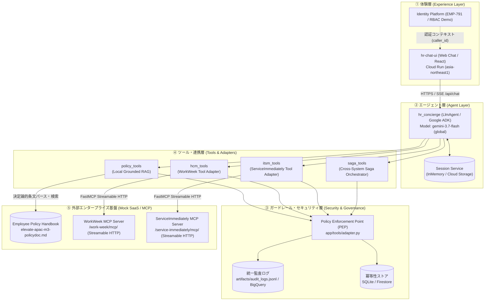

# Elevate APAC HR & IT Concierge (`hr-concierge`)

> **Google Cloud 東京リージョン（`asia-northeast1`）および Vertex AI を基盤とする、エンタープライズ向け HR & IT 自律型エージェントシステム**

本リポジトリは、Elevate APAC における社内人事規程（Employee Handbook）の照会、人事基盤（**WorkWeek**）、IT サービス管理基盤（**ServiceImmediately**）のセルフサービス操作、および複数システムを跨ぐ横断トランザクション（Saga）を安全かつ自律的に遂行する AI エージェントの完全な実装です。

---

## 1. システム概要 (System Overview)

本システムは、従来の定型的な問い合わせ対応（Tier 1 HR/IT サポート）を自動化し、従業員が自然言語で対話するだけで各種手続きや規程調査を安全に完了できるように設計されています。

### 3 つの中核機能ドメイン
1. **規程 Q&A (UC-1.1)**:
   - 正式な人事規程ハンドブック（`elevate-apac-m3-policydoc.md`）に基づき、ハルシネーション（虚偽情報）のない根拠条文引用（`Section X.Y`）付き回答を提供。
2. **HRMS 操作 (WorkWeek / UC-1.2)**:
   - 休暇残高（Vacation / Sick）のリアルタイム照会、申請履歴確認、住所・電話番号の更新、および有給・病気休暇の申請・取消。
3. **ITSM 操作 (ServiceImmediately / UC-1.3 & UC-2.x)**:
   - IT インシデント/備品申請チケットの照会・起票、コメント追加、ライフサイクル状態遷移。
   - **Cross-System Saga**: 在宅勤務移行に伴う WorkWeek の住所変更と ServiceImmediately の備品手配をアトミックに実行し、途中失敗時には補償トランザクションによる自動ロールバックを実施。

---

## 2. システムアーキテクチャ (System Architecture)

本システムは、**「AI に判断させる領域（柔軟・確率的）」** と **「システムが強制する領域（厳格・決定論的）」** を分離するアーキテクチャを採用しています。

### アーキテクチャ構成図



---

## 3. レイヤ定義と責務

| レイヤ | 主要コンポーネント | 責務と特徴 |
| :--- | :--- | :--- |
| **体験層 (UI)** | `hr-chat-ui` (Cloud Run) | ストリーミング対話 (SSE)、クリック可能な規程引用 Drawer、HITL 承認カード、WorkWeek/ITSM リアルタイム状態サイドパネル、監査ログビューア。 |
| **エージェント層** | `hr_concierge` (ADK Agent) | Google ADK 製の自律型エージェント。ユーザー意図を解釈し、適切なツール（Policy / HCM / ITSM / Saga）を選択・実行。モデルには `gemini-3.7-flash` を採用。 |
| **セキュリティ・ガバナンス層** | `Policy Enforcement Point` | すべてのツール呼び出しをインターセプトし、**RBAC データ分離 (P6)**、**業務ガードレール (P1)**、**HITL 確認 (P3)**、**冪等性 (P2)**、**統一監査ロギング (P7)** をコードとして決定論的に強制。 |
| **ツール層** | `policy_tools`, `hcm_tools`, `itsm_tools`, `saga_tools` | 下流システムへの接続アダプタ。MCP クライアントおよびローカル検索エンジンをカプセル化。 |
| **外部システム層** | FastMCP Servers, Policy KB | `WorkWeek`（人事）および `ServiceImmediately`（IT）の MCP エンドポイント。Stateless Streamable HTTP トランスポートで通信。 |

---

## 4. コア設計原則 (Design Principles P1〜P7)

本ソリューションのすべての実装は、次の 7 つの原則に基づいています：

- **P1: 二層ガードレール (Two-Tier Guardrails)**:
  - 業務ルール（休暇残高不足、病気休暇の診断書要件、チケットの不正ステータス遷移など）を LLM のプロンプトだけに頼らず、ツール層の**Python コードで決定論的に強制**します。
- **P2: ツール層＝ポリシー実施点 (Policy Enforcement Point - PEP)**:
  - エージェントは「実行意図」を出力するのみであり、実際の認可、バリデーション、冪等性検証はツール層の PEP で実行されます。仮にプロンプトインジェクションが発生しても、権限外の操作は物理的にブロックされます。
- **P3: 書き込み操作の Human-in-the-Loop (HITL)**:
  - システムへの書き込み（休暇申請、連絡先変更、チケット作成・変更、Saga 実行）は、初回到達時に `CONFIRMATION_REQUIRED` を返し、UI 上でユーザーが明示的に承認（`user_confirmed=True`）するまでコミットされません。
- **P4: 動的データのキャッシュ禁止**:
  - セッション状態はユーザー単位に限定し、グローバル共有キャッシュを禁止。従業員の残高や連絡先は毎回バックエンドから取得し、情報漏洩を防ぎます。
- **P5: フェイルクローズ (Fail-Closed)**:
  - ガードレールや検証サービスに障害が発生した場合、リクエストを許可するのではなく安全側に倒して拒否（停止）します。
- **P6: 1 リクエスト＝1 ユーザースコープの委譲 (RBAC Data Isolation)**:
  - 共有サービスアカウントでの全権限呼び出しを禁止し、`caller_id == employee_id` を厳格に検証。他人の個人情報閲覧や申請代行をツール層でブロックします。
- **P7: すべての行為を追跡可能に (Auditability)**:
  - 成功した操作だけでなく、**「ガードレールにより拒否された操作」も含め**、すべてのツール実行を統一監査スキーマ（Event ID, Actor, Timestamp, Decision, Deny Reason）で記録します。

---

## 5. 業務ガードレール実装一覧

| ガードレール ID | 対象システム | 内容 | 違反時の挙動 |
| :--- | :--- | :--- | :--- |
| **G-HCM-1** | WorkWeek | 申請日数が WorkWeek 上のリアルタイム残余日数を上回る申請を拒否 | `DENIED` (`G-HCM-1_INSUFFICIENT_BALANCE`) |
| **G-HCM-2** | WorkWeek | 過去日付の申請、開始日より前の終了日、30日前の事前申請がない無給休暇を拒否 | `DENIED` (`G-HCM-2_PAST_START_DATE` 等) |
| **G-HCM-3** | WorkWeek | 既存の休暇申請期間と重複する日程の申請を拒否 | `DENIED` (`G-HCM-3_OVERLAPPING_LEAVE`) |
| **G-HCM-4** | WorkWeek | 蓄積された代休 (TOIL) がある場合、有給休暇よりも先に消化することを強制 (Section 25.3) | `DENIED` (`G-HCM-4_TOIL_MUST_BE_USED_FIRST`) |
| **G-HCM-5** | WorkWeek | 2 営業日を超える病気休暇の申請において、医師の診断書（MC）がない場合を拒否 (Section 19.2) | `DENIED` (`G-HCM-5_MEDICAL_CERTIFICATE_REQUIRED`) |
| **G-HCM-6/7** | WorkWeek | 5文字未満の住所や無効な電話番号フォーマットを拒否 | `DENIED` (`G-HCM-6_INVALID_ADDRESS` 等) |
| **G-ITSM-1** | ServiceImmediately | チケット状態遷移を検証。`New` から `Closed` への直接スキップを拒否 (Section 5.5) | `DENIED` (`G-ITSM-1_INVALID_STATE_TRANSITION`) |
| **G-ITSM-2** | ServiceImmediately | Priority 1 (Critical) はシステム障害・停止のみ許可。軽微な設備修理での優先度詐称を拒否 | `DENIED` (`G-ITSM-2_CRITICAL_REQUIRES_OUTAGE`) |
| **G-ITSM-3** | ServiceImmediately | 同一カテゴリかつ同一内容のオープンチケットが存在する重複作成を拒否 | `DENIED` (`G-ITSM-3_DUPLICATE_TICKET`) |
| **G-POLICY-1** | Policy KB | ホストギフトへのギフトカード贈答（Section 4.3）や 500 USD を超える在宅勤務機器（Section 5.4）を拒否 | `DENIED` (規定引用付き拒否) |

---

## 6. ディレクトリ構成 (Repository Layout)

```
.
├── app/                        # ADK エージェントコア
│   ├── agent.py                # ルートエージェント定義 & プロンプトインストラクション
│   ├── fast_api_app.py         # ADK 標準 FastAPI エントリポイント
│   └── tools/                  # ツール・ガードレール実装 (PEP)
│       ├── adapter.py          # 監査ログ、冪等性、RBAC 検証
│       ├── hcm_tools.py        # WorkWeek (HCM) ツール & ガードレール
│       ├── itsm_tools.py       # ServiceImmediately (ITSM) ツール & ガードレール
│       ├── mcp_client.py       # FastMCP Streamable HTTP クライアント
│       ├── policy_tools.py     # 規程 RAG 検索エンジン (正規化・スコアリング)
│       └── saga_tools.py       # 横断 Saga トランザクション & 自動補償
├── ui/                         # チャット体験層 (Cloud Run デプロイ対象)
│   ├── server.py               # SSE ストリーミング、状態照会 API、監査ログ API
│   └── static/                 # フロントエンド (HTML / CSS / JS)
│       ├── index.html          # チャット & ガバナンスパネル UI
│       ├── app.js              # SSE レシーバ、HITL 承認ハンドラ、自動更新
│       └── styles.css          # テーマ定義、レスポンシブデザイン
├── knowledge/                  # 規程セクション別 Markdown
├── elevate-apac-m3-policydoc.md # 正式版 人事規程ハンドブック
├── artifacts/                  # 監査ログ (`audit_logs.jsonl`)、各種レポート
├── sdd.md                      # Solution Design Document (詳細設計仕様書)
├── Dockerfile                  # Cloud Run 用コンテナ定義
└── pyproject.toml              # プロジェクト依存関係定義
```

---

## 7. デプロイ環境と稼働状況

| 環境 | ホスティング / サービス | URL / エンドポイント | 備考 |
| :--- | :--- | :--- | :--- |
| **Cloud Run (Web UI)** | Cloud Run (`asia-northeast1`) | [hr-concierge-ui](https://hr-concierge-ui-318552719930.asia-northeast1.run.app) | 本番用 Web チャット・状態パネル |
| **Agent Engine** | Vertex AI Agent Engine (`asia-northeast1`) | `projects/318552719930/locations/asia-northeast1/reasoningEngines/...` | バックエンド Reasoning Engine |
| **Local Development** | Uvicorn / Local Cloudtop | `http://minsoojun.c.googlers.com:8090/` | ローカル開発・検証環境 |
| **GitHub Repository** | GitHub (`main` branch) | [minsoo-jun/elevate-group-6](https://github.com/minsoo-jun/elevate-group-6) | ソースコード管理 |

---

## 8. 開発・実行コマンド

### ローカル環境での起動
```bash
# 依存関係のインストール
uv sync

# ローカル UI サーバーの起動 (ポート 8090)
set -a; source .env; set +a
uv run uvicorn ui.server:api --host 0.0.0.0 --port 8090
```

### ユニットテスト & ガードレール検証
```bash
uv run pytest tests/unit
```

### コンテナイメージのビルド & Cloud Run デプロイ
```bash
# Cloud Build によるコンテナイメージ作成
gcloud builds submit --project=elevate-group-6 --region=asia-northeast1 --tag=asia-northeast1-docker.pkg.dev/elevate-group-6/cloud-run-source-deploy/hr-concierge-ui:latest

# Cloud Run へのデプロイ
gcloud run deploy hr-concierge-ui \
  --project=elevate-group-6 \
  --region=asia-northeast1 \
  --image=asia-northeast1-docker.pkg.dev/elevate-group-6/cloud-run-source-deploy/hr-concierge-ui:latest \
  --command=uv \
  --args="run,uvicorn,ui.server:api,--host,0.0.0.0,--port,8080" \
  --allow-unauthenticated
```
