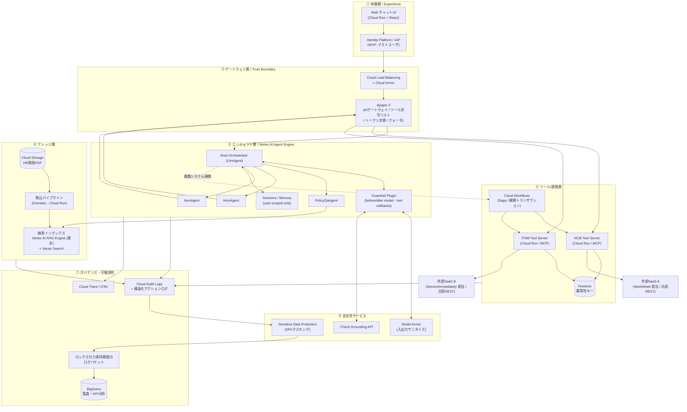
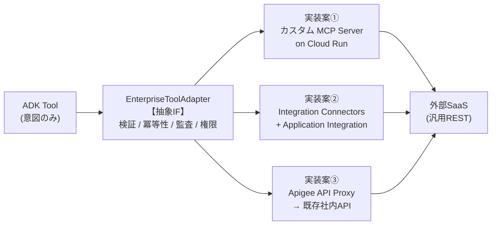
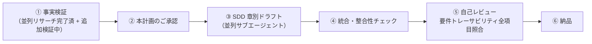

# HR向けエージェント型ソリューション — SDD 作成計画

BRD（MVP 1）を実装可能な **Solution Design Document (SDD)** に落とし込むための計画です。
本ドキュメントは「SDDそのもの」ではなく、**SDDで採用する設計方針・構成・章立てを事前合意する**ためのものです。
承認いただければ、この骨子に沿って完全版SDD（日本語 / Markdown / 約 60〜80ページ相当）を作成します。

---

## 1. ゴールと成果物

| 項目 | 内容 |
| :--- | :--- |
| **成果物** | `hr_agent_solution_design.md`（日本語・単一Markdownアーティファクト） |
| **含むもの** | アーキテクチャ図(Mermaid) / コンポーネント設計 / データ設計 / セキュリティ設計 / 要件トレーサビリティマトリクス / 非機能・SLO設計 / テスト評価計画 / コスト概算 / フェーズ計画 / リスク登録簿 |
| **前提（確定済）** | ADK + Vertex AI Agent Engine 主軸 / 東京 (asia-northeast1) 優先・日本国内データレジデンシー要件あり / バックエンドは匿名のまま汎用REST抽象化（コネクタは選択肢併記）/ シングルテナント・テスト資格情報 |
| **想定読者** | お客様のHR部門意思決定者、IT/セキュリティ部門、実装ベンダー |

> [!IMPORTANT]
> 「重要度」と「お客様満足」を最重要目標とのご指示のため、SDDは
> **(a) BRDの全22要件(FR/NFR)に対する1対1のトレーサビリティ**、
> **(b) 受入基準(BRD 7章)の9指標すべてに対する測定方法の明示**、
> **(c) 実現できない/リスクのある要件の正直な明示と代替案** の3点を必須品質とします。
> 「できます」と言い切らず、根拠URL付きで検証可能な設計にします。

---

## 2. 提案アーキテクチャ（骨子）

### 2.1 全体構成



### 2.2 中核となる設計原則（SDDの背骨）

| # | 原則 | なぜ重要か | 対応要件 |
| :-- | :--- | :--- | :--- |
| **P1** | **二層ガードレール**：確率的防御（Model Armor / LLM判定）と**決定論的防御**（ツール層のコード化バリデータ）を分離。業務ルールをLLMに守らせない。 | 「休暇残高を超える申請を拒否」等をプロンプトで守らせるのは原理的に破られる。コードで強制する。 | FR-1.3, FR-3.3, FR-4.3 |
| **P2** | **ツール層＝ポリシー実施点 (PEP)**。エージェントは「意図」を出すだけ。検証・認可・冪等性はすべてツール層/Apigeeで実施。 | プロンプトインジェクションが成功しても、実行できる操作の範囲を超えられない（ブラストラディウス封じ込め）。 | FR-1.1, FR-1.2, FR-1.5 |
| **P3** | **書き込み操作は必ず人間確認 (HITL)**。ADK `require_confirmation=True` / `tool_context.request_confirmation()` で実行前に要約提示→ユーザ承認。 | Google SAIF の agent hijacking 対策の中核。誤作動・不正実行のゼロ化に直結。 | FR-1.3, FR-3.2, FR-4.2 |
| **P4** | **動的データはキャッシュしない**。セッション状態は user スコープのみ。app スコープ状態を禁止。 | FR-3.4 の明示要件かつ、ユーザ間データ漏洩の最大の原因を構造的に排除。 | FR-2.2, FR-3.4, FR-1.5 |
| **P5** | **フェイルクローズ**。ガードレールサービス障害時は「通す」のではなく「止める」。 | 安全側に倒す。ただしNFR-4.1のユーザ体験と両立させる文言設計を行う。 | NFR-1.1, NFR-4.1 |
| **P6** | **1リクエスト＝1ユーザースコープの委譲トークン**。サービスアカウントの共有トークンで下流を叩かない。 | FR-3.1「複合認証トークン」の実体。監査ログで「誰の代理か」が常に一意に定まる。 | FR-1.2, FR-3.1, FR-1.5 |
| **P7** | **すべての行為を追跡可能に**。許可・拒否の両方を、発信元（自動 vs 人手）を区別して記録。 | BRD 7章「カバー率100%」の受入基準を満たす唯一の方法。 | FR-1.2, FR-4.1, NFR-1.2 |

### 2.3 バックエンド連携の抽象化方針（ご指定に対応）

BRDの匿名名を維持し、**`EnterpriseToolAdapter` という抽象インタフェース**を定義した上で、実装を3案併記します。



MVP 1 の推奨は **案①（カスタムMCP Server）**。理由はFR-3.3/FR-4.3の業務ガードレール（残高チェック、時系列妥当性、ステータス遷移制限、重複防止、優先度検証）を**自前コードで完全に制御**でき、単体テストで100%検証可能なため。案②はコネクタが存在する場合に開発量を削減できる代替として比較表で提示します。

---

## 3. 重点設計領域（ご選択いただいた全7領域）

| 領域 | SDDで書く主な内容 |
| :--- | :--- |
| **A. セキュリティ／ガードレール** | 脅威モデル（STRIDE + OWASP LLM Top 10 + SAIF）、Model Armor テンプレート設計、プロンプトインジェクション多層防御マトリクス、SPII検出・マスキング設計（日本固有infoType含む）、監査ログ設計（ロック保持ポリシー／BigQuery分析）、フェイルクローズ設計 |
| **B. オーケストレーションと整合性** | UC-2.1〜2.3 のシーケンス図、Saga/補償トランザクション設計、冪等性キー設計、失敗時のユーザ向け「手動対応手順」生成、部分失敗の状態機械 |
| **C. RAG（規程Q&A）** | 取込パイプライン（レイアウト認識チャンキング）、引用メタデータ→クリック可能ディープリンク生成、Check Grounding によるスコア閾値での**回答拒否**、ドメイン外プロンプト拒絶、鮮度SLO（FR-5.5の`[X]`を具体値で提案） |
| **D. 認証・認可** | エンドユーザ認証（MVP: テストIdP）→エージェント→下流SaaSまでのID伝播フロー図、OAuth 2.0 Token Exchange (RFC 8693)、RBACモデル、データ隔離の実装と検証方法 |
| **E. 非機能・SLO** | レイテンシ予算配分表（TTFT 10秒 / ガードレール300ms の内訳と実現可否の正直な評価）、可用性99.9%の直列依存合成計算、DR/RTO/RPO、グレースフルデグラデーション設計 |
| **F. テスト・評価計画** | BRD 7章の9指標 × 測定方法 × 合格基準 × 使用ツールの対応表、ゴールデンデータセット設計、レッドチーム用プロンプト集の作り方、誤検知率1%未満の測定手順 |
| **G. コスト・ロードマップ** | 月額コスト概算（利用量前提を明示したモデル）、MVP→本番のフェーズ計画、本番化で追加すべき項目（SSO、マルチテナント、多言語） |

---

## 4. User Review Required — 重要な設計判断（事実検証済み）

### 4.0 東京リージョン適合性の検証結果サマリ

ご指定の「東京 (asia-northeast1) 優先・日本国内データレジデンシー」に対し、全構成要素を公式ドキュメントで検証しました。

| サービス | 東京(asia-northeast1) | 判定 | 出典 |
| :--- | :---: | :--- | :--- |
| Vertex AI Agent Engine | ✅ 対応 | そのまま採用可 | [locations](https://cloud.google.com/vertex-ai/docs/general/locations) |
| Gemini モデル（リージョンEP） | ✅ 対応 | 保存データ・ML処理ともに国内完結。※`global`エンドポイントは境界を無効化するため**使用禁止**とする | [Vertex AI locations](https://cloud.google.com/vertex-ai/generative-ai/docs/learn/locations) |
| **Vertex AI Search / Discovery Engine** | ❌ **非対応** | **`global` / `us` / `eu` のみ。日本国内レジデンシー不可** | [Discovery Engine locations](https://cloud.google.com/generative-ai-app-builder/docs/locations) |
| Vertex AI RAG Engine | ✅ 対応 | Vertex AI Search の代替として成立 | [locations](https://cloud.google.com/vertex-ai/docs/general/locations) |
| Model Armor | ⚠️ 条件付き | 東京で利用可だが機能セットが限定される可能性（要実機確認） | [Model Armor](https://cloud.google.com/security-command-center/docs/model-armor) |
| Sensitive Data Protection (DLP) | ✅ 対応 | リージョナルEP `dlp.asia-northeast1.rep.googleapis.com` を明示指定 | [DLP locations](https://cloud.google.com/sensitive-data-protection/docs/locations) |
| Apigee X | ✅ 対応 | インスタンス・アタッチメントを全て東京に | [Apigee locations](https://cloud.google.com/apigee/docs/api-platform/get-started/locations) |
| Integration Connectors / App Integration | ✅ 対応 | — | [App Integration locations](https://cloud.google.com/application-integration/docs/locations) |
| Cloud Run / Workflows / Firestore / BigQuery | ✅ 対応 | — | — |
| Assured Workloads | ✅ 対応 | **Japan Data Boundary** 統制パッケージあり（CMEK必須・Access Transparency） | [Assured Workloads](https://cloud.google.com/assured-workloads/docs) |
| Gemini Enterprise (Agentspace) | ⚠️ 要申請 | 日本DRZは「GA with allowlist」。事前に営業経由の許可申請が必要 | [Gemini Enterprise locations](https://docs.cloud.google.com/gemini/enterprise/docs/locations) |

> [!CAUTION]
> **① 【確定した阻害要因】Vertex AI Search は東京リージョンで利用できません。**
> データストアは `global` / `us` / `eu` のみです。したがって、日本国内データレジデンシーを
> 厳格に満たす限り、**マネージド検索（Vertex AI Search）を規程Q&Aの基盤に採用できません。**
> SDDでは次の3案を比較表で提示し、**案Bを推奨**する方針です。
>
> | 案 | 構成 | レジデンシー | 開発工数 | 引用メタデータ | 備考 |
> | :-- | :--- | :---: | :---: | :--- | :--- |
> | **A** | Vertex AI Search（`us`/`eu`） | ❌ | 小 | 標準で page 番号取得可 | 要件を満たさない。要件緩和時のみ |
> | **B（推奨）** | **Vertex AI RAG Engine（東京）+ Document AI Layout Parser + Vector Search** | ✅ | 中 | 自前でチャンクメタデータ設計 | マネージド度と統制のバランスが最良 |
> | **C** | Vector Search / AlloyDB 自前RAG（東京） | ✅ | 大 | 完全自前 | 最大の自由度。運用負荷も最大 |
>
> **ご判断いただきたい点：** 日本国内レジデンシー要件は **保存データ(at rest) のみ**でしょうか、
> それとも **推論処理(ML processing) も含む**でしょうか。前者かつ「規程文書は社内公開レベルで
> 機微性が低い」と整理できるなら案Aも選択肢に戻ります（開発工数が大幅に下がります）。

> [!CAUTION]
> **② 【確定】NFR-2.1「安全性スキャン 300ms/ターン以内」は Google の公式保証が存在しません。**
> 検証の結果、Model Armor に公表レイテンシ値・SLAは**ありません**。公式ドキュメントは
> 「レイテンシが増加しうる」と述べ、ストリーミング・サニタイズによる緩和を推奨するに留まります。
> SDDでは以下の構成で対応します。
> - **レイテンシ予算表**：入力スキャン（TTFTに直列加算）／出力スキャン（ストリーミング分割スキャン）に分解
> - **削減策**：同一リージョン配置、コネクション再利用、入力スキャンとRAG検索の並列実行
> - **300ms を「設計目標」として扱い、MVPのExit Criteria に実測を組み込む**。未達時の緩和策
>   （高速パス＝DLP+RAIのみ同期 ／ 完全スキャンは非同期精査）を事前に用意
>
> ここを「達成できます」と断言しないことが、結果的にお客様の信頼につながると考えます。

> [!WARNING]
> **③ 【新規発見】NFR-2.2「可用性99.9%」は、直列構成では数学的に達成不可能です。**
> 各サービスの公表SLAを直列合成すると 99.9% を下回ります。
>
> ```
> Apigee X (99.9%) × Cloud Run (99.95%) × Vertex AI (99.9%) × 連携層 (99.9%)
>   = 0.999 × 0.9995 × 0.999 × 0.999 ≈ 0.9965 → 約 99.65%
> ```
>
> さらに外部SaaS（WorkWeek / ServiceImmediately 相当）のSLAは Google の管理外です。
> SDDでは次の整理を提案します。
> - **SLO の対象範囲を「Google Cloud 側の制御可能部分」に限定して定義**し、外部SaaS依存部分を除外
> - 規程Q&A（読み取り専用）と取引系（書き込み）で**別SLOを設定**（前者は高く、後者は外部依存で低く）
> - 可用性向上策：Apigee マルチリージョン（99.99%）、読み取りキャッシュ、
>   非同期化・グレースフルデグラデーションによる「部分稼働」の定義
> - **「99.9%」をどのSLIで測るかをお客様と合意すること自体**を、受入の前提条件として明記

> [!IMPORTANT]
> **④ 「ハルシネーション0%」「検知率100%」「処理正確性100%」という絶対値目標の扱い。**
> 確率的モデル単体で0%/100%は保証できません。SDDでは
> **「決定論的な制御で100%を担保できる範囲」と「統計的に測定・改善する範囲」を明確に分離**します。
>
> | 受入基準 | 担保方式 | SDDでの扱い |
> | :--- | :--- | :--- |
> | 規程ハルシネーション 0% | **決定論的** | Check Grounding スコア閾値未満は強制的に回答拒否。「根拠なき回答を出さない」ことで構造的に担保し、副作用の**拒否率**を別KPI化 |
> | 処理正確性 100% | **決定論的** | ツール層バリデータ＋冪等性＋HITL確認。単体テストで100%証明可能 |
> | 監査カバー率 100% | **決定論的** | ログ出力をコードパスに強制し、欠落検知テストで保証 |
> | インジェクション検知率 100% | **統計的** | 既知テストケース集合に対する100%を目標。未知攻撃は原則P2「ブラストラディウス封じ込め」で被害を限定 |
> | 誤検知率 1%未満 | **統計的** | 正当質問のコントロールセットで測定 |
>
> この「分離」をお客様と合意できるかが、受入試験の成否を分けます。

> [!NOTE]
> **⑤ MVPのユーザ認証。** BRDで SSO は対象外ですが、FR-1.5（RBAC・データ隔離）と
> FR-3.1（委譲権限）の検証にはエンドユーザIDが不可欠です。
> SDDでは「**Identity Platform 上のテストユーザ（従業員IDにマッピング）**を用い、
> 本番SSOに置換可能なインタフェースで実装する」方針を提案します。

---

## 5. Open Questions — 回答いただけるとSDDの精度が上がります

以下は**未回答でもSDD作成は可能**です（その場合は妥当な仮定を明示して進めます）。

| # | 質問 | 未回答時の仮定 |
| :-- | :--- | :--- |
| **Q1 ⚠️最重要** | 「日本国内データレジデンシー」は **保存データ(at rest) のみ**か、**推論処理(ML processing) も含む**か？ → §4.0 ① の案A/B/C の選択に直結 | 両方含むものとし、**案B（RAG Engine 東京）**を推奨構成として設計 |
| Q2 | 対象従業員数・想定会話数／月は？（コスト概算とSLO設計の前提） | 従業員 5,000名 / 20,000会話・月 / ピーク 50同時 と仮定 |
| Q3 | FR-5.5 の規程同期タイムラグ `[X]` の期待値は？ | **15分以内**（イベント駆動取込で実現）を提案値とする |
| Q4 | 規程ドキュメントの現在の保管場所は？（Google Drive / SharePoint / ファイルサーバ / 社内Wiki） | Cloud Storage へ集約する前提。Drive/SharePoint連携は選択肢として併記 |
| Q5 | チャットUIは自前Web画面か、既存の企業チャット（Google Chat / Teams / Slack）連携か？ | 自前Web画面を主、Google Chat 連携を将来拡張として記載 |
| Q6 | お客様側に既存のGoogle Cloud組織／Landing Zone はあるか？ | 新規プロジェクト3面（dev/stg/prod）を前提に記載 |
| Q7 | 監査ログの保持期間要件は？（法定要件の有無） | 7年（ロック保持ポリシー適用）を提案値とする |
| Q8 | SDDの提出先はエンジニア中心か、経営層も含むか？ | 両方を想定し、冒頭にエグゼクティブサマリ＋意思決定サマリを配置 |

---

## 6. SDD 章立て（案）

<details>
<summary>クリックで全章構成を展開</summary>

```
0. エグゼクティブサマリ / 意思決定サマリ（1ページ）
1. はじめに
   1.1 目的とスコープ / 1.2 BRDとの関係 / 1.3 用語定義 / 1.4 前提と制約
2. ソリューション概要
   2.1 コンセプト / 2.2 全体アーキテクチャ図 / 2.3 設計原則 P1-P7
   2.4 技術選定の根拠と代替案比較（Agent Engine vs Cloud Run vs GKE 等）
3. 論理アーキテクチャ
   3.1 レイヤ定義 / 3.2 コンポーネント一覧と責務 / 3.3 エージェント階層設計
   3.4 ツール定義カタログ（全ツールのシグネチャと権限）
4. ユースケース詳細設計
   4.1 UC-1.1 規程Q&A（シーケンス図）
   4.2 UC-1.2 HRセルフサービス（シーケンス図・HITLフロー）
   4.3 UC-1.3 ITインシデント管理（シーケンス図）
   4.4 UC-2.1/2.2/2.3 システム横断（Saga・補償トランザクション・状態機械）
5. ナレッジ層設計（RAG）
   5.1 取込パイプライン / 5.2 チャンキング戦略 / 5.3 引用とディープリンク生成
   5.4 グラウンディング強制と回答拒否ロジック / 5.5 鮮度SLOと同期設計
6. 連携層設計
   6.1 抽象インタフェース定義 / 6.2 実装案比較（MCP / コネクタ / Apigee）
   6.3 業務ガードレール実装仕様（FR-3.3, FR-4.3の全ルールを表で）
   6.4 冪等性・リトライ・タイムアウト設計
7. セキュリティ設計
   7.1 脅威モデル（STRIDE + OWASP LLM Top10 + SAIF）
   7.2 多層防御マトリクス / 7.3 Model Armor 設計 / 7.4 SPII マスキング設計
   7.5 認証・認可・ID伝播 / 7.6 RBACとデータ隔離 / 7.7 ネットワーク境界(VPC-SC)
   7.8 鍵管理(CMEK) / 7.9 監査ログ設計
8. 非機能設計
   8.1 レイテンシ予算配分 / 8.2 可用性設計と合成計算 / 8.3 スケーラビリティ
   8.4 DR / RTO / RPO / 8.5 SLI・SLO・エラーバジェット定義
   8.6 グレースフルデグラデーション設計（ユーザ向けメッセージ文例集）
9. 可観測性と運用
   9.1 ログ・メトリクス・トレース設計 / 9.2 ダッシュボードとアラート
   9.3 KPI計測（チケット40%削減の測定方法）/ 9.4 運用体制とRunbook
10. テストと評価計画
   10.1 受入基準9指標 × 測定方法 対応表
   10.2 ゴールデンデータセット設計 / 10.3 レッドチーム計画
   10.4 CI/CD と継続的評価（品質フライホイール）
11. 要件トレーサビリティマトリクス（FR/NFR 全22項目）
12. コスト概算
13. 実装ロードマップとフェーズ計画
14. リスク登録簿と緩和策
15. 本番化に向けた将来拡張（SSO / マルチテナント / 多言語 / 音声）
付録A. ADK 参考実装スケルトン
付録B. 参照ドキュメントURL一覧
```

</details>

---

## 7. 作成プロセスと品質保証



### 検証（Verification）方針

| 観点 | やること |
| :--- | :--- |
| **事実の正確性** | すべてのGoogle Cloud製品仕様に `cloud.google.com` の出典URLを付与。確認できない事項は `[要検証]` と明記し、推測で書かない。 |
| **要件カバレッジ** | BRDのFR 15項目 + NFR 9項目 + UC 6件 + 受入基準9指標を機械的に照合し、抜けゼロを確認。 |
| **内部整合性** | アーキ図・シーケンス図・コンポーネント表・コスト表の間でコンポーネント名が一致していることを確認。 |
| **実現可能性** | 「できない／リスクがある」項目を隠さずリスク登録簿に記載。 |

---

## 8. 想定作業量

| フェーズ | 内容 | 目安 |
| :--- | :--- | :--- |
| 1 | 追加事実検証の完了（実行中） | 数分 |
| 2 | 本計画のご承認 | ご確認待ち |
| 3 | SDD執筆（並列サブエージェントで章別分担） | 20〜40分 |
| 4 | 統合・整合性チェック・自己レビュー | 10分 |

---

## 参照した一次情報（抜粋 / SDDでは全件付録に収録）

- [Vertex AI 生成AI ロケーション](https://cloud.google.com/vertex-ai/generative-ai/docs/learn/locations)
- [Model Armor 概要](https://cloud.google.com/model-armor/docs/overview)
- [Check Grounding API](https://cloud.google.com/vertex-ai/generative-ai/docs/grounding/check-grounding)
- [ドキュメントの解析とチャンク化（Layout Parser）](https://cloud.google.com/generative-ai-app-builder/docs/parse-chunk-documents)
- [Sensitive Data Protection infoType リファレンス](https://cloud.google.com/sensitive-data-protection/docs/infotypes-reference)
- [Google Secure AI Framework (SAIF)](https://saif.google/)
- [Cloud Logging 保持期間とロック](https://cloud.google.com/logging/docs/routing/logs-retention)
- [Workload Identity Federation](https://cloud.google.com/iam/docs/workload-identity-federation)
- [Gen AI Evaluation Service](https://cloud.google.com/vertex-ai/generative-ai/docs/models/evaluation-overview)
