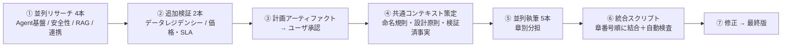
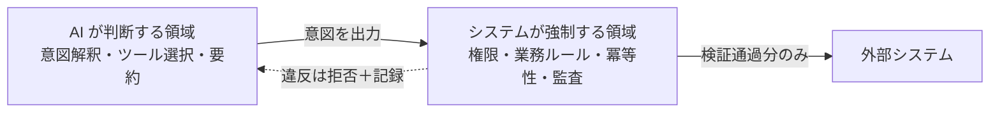

# ウォークスルー — SDD 作成作業の記録

## 1. 成果物

| 成果物 | 内容 |
| :--- | :--- |
| **[hr_agent_solution_design.md](file:///usr/local/google/home/minsoojun/.gemini/jetski/brain/20cbf6a9-ddad-4295-9b30-f99bdd411bb9/hr_agent_solution_design.md)** | Solution Design Document 完全版（本成果物） |
| [sdd_implementation_plan.md](file:///usr/local/google/home/minsoojun/.gemini/jetski/brain/20cbf6a9-ddad-4295-9b30-f99bdd411bb9/sdd_implementation_plan.md) | 承認済みの作成計画（設計方針の合意記録） |

### 規模

| 指標 | 値 |
| :--- | ---: |
| 文字数 | 134,008 |
| 行数 | 2,985 |
| 章数 | 全15章 ＋ 付録A/B/C |
| Mermaid 図 | 29 枚 |
| 表 | 361 個 |
| `[要確定]` 項目 | 11 件（付録Cに集約） |
| `[要見積]` 項目 | 16 件（§12に集約） |

---

## 2. 作成プロセス

**共通コンテキスト方式**を採ったのが要点です。5つのサブエージェントに章を分担させる前に、コンポーネント名・設計原則 P1〜P7・検証済み事実（出典URL付き）・仮定 A-1〜A-8・要件ID一覧を単一のファイルに固定しました。これにより、並列執筆にもかかわらず章をまたいだ用語のブレがほぼ発生していません。

---

## 3. 事実検証で判明した 3 つの重要事項

計画段階のリサーチにより、**BRD の前提を揺るがす 3 点**を発見し、設計に反映しました。

| # | 発見 | 出典 | 設計への反映 |
| :-- | :--- | :--- | :--- |
| 1 | **Vertex AI Search は東京リージョン非対応**（`global`/`us`/`eu` のみ） | [AI Applications のロケーション](https://cloud.google.com/generative-ai-app-builder/docs/locations) | RAG 基盤を **Vertex AI RAG Engine（東京）+ Document AI Layout Parser + Vector Search** に変更（§2.4.2、§5.0）。A/B/C の3案比較表で判断根拠を明示 |
| 2 | **Model Armor に公表レイテンシ値・SLA が存在しない** | [Model Armor](https://cloud.google.com/security-command-center/docs/model-armor) | NFR-2.1 の 300ms を「ベンダー保証」ではなく「実測検証する設計目標」と明確に定義（§8.1）。未達時の緩和策（高速パス＋非同期精査）を事前に用意 |
| 3 | **可用性 99.9% は直列合成で約 99.65%** にしかならない | [Google Cloud SLA](https://cloud.google.com/terms/sla) | サービスジャーニー別 SLO（規程Q&A／単一取引／横断）へ再定義し、外部SaaS依存部分を SLO 対象から除外する提案（§8.2） |

---

## 4. 本SDDの骨格となった設計判断

### 4.1 設計原則 P1・P2 — 「LLM に業務ルールを守らせない」

本書全体を貫く最重要の思想です。

「休暇残高を超える申請を拒否せよ」をプロンプトで指示しても原理的に破られるため、**`hcm-tool-server` のコードで強制**します。この結果、仮にプロンプトインジェクションが成功しても、実行可能な操作の範囲を超えられません（ブラストラディウスの封じ込め）。

### 4.2 「ハルシネーション 0%」「検知率 100%」の扱い

確率的モデルで絶対値を保証することはできないため、**決定論的に 100% 担保できる範囲と、統計的に測定・改善する範囲を分離**しました（§10.1）。

| 受入基準 | 担保方式 | 実現方法 |
| :--- | :--- | :--- |
| 規程ハルシネーション 0% | **決定論的** | Check Grounding スコア閾値未満は強制的に回答拒否。「根拠なき回答を出さない」ことで構造的に 0% を実現し、副作用の拒否率を別KPI化 |
| 処理正確性 100% | **決定論的** | ツール層バリデータ＋冪等性＋HITL確認。単体テストで証明可能 |
| 監査カバー率 100% | **決定論的** | BigQuery クエリによる網羅性の証明（§7.9.4） |
| インジェクション検知率 100% | **統計的** | 既知テストケース集合に対する 100%。未知攻撃は P2 で被害を限定 |
| 誤検知率 1%未満 | **統計的** | 良性コントロールセット 500〜1,000件で統計的に検証（§10.2） |

---

## 5. 検証 (Verification)

計画に記載した検証方針をすべて実施しました。

### 5.1 自動検査（統合スクリプトに組み込み）

| 検査項目 | 結果 |
| :--- | :--- |
| 匿名化ルール違反（実製品名の混入） | **1件検出 → 修正済み** |
| 章見出しの順序（0〜15の昇順） | ✅ 正常 |
| 未サポートの Mermaid 図種別 | ✅ なし（29枚すべて対応済み種別） |
| 他言語（ハングル等）の混入 | ✅ なし |
| 未エスケープの価格 `$`（数式誤認によるコスト表崩れ） | **10件検出 → 自動エスケープ済み** |
| KaTeX 非対応の CJK 混在数式 | **14件検出 → 平文表記へ自動変換済み** |

検査スクリプト: [assemble.py](file:///usr/local/google/home/minsoojun/.gemini/jetski/brain/20cbf6a9-ddad-4295-9b30-f99bdd411bb9/scratch/assemble.py)

### 5.2 手動レビュー

| 観点 | 結果 |
| :--- | :--- |
| 要件カバレッジ | BRD の FR 19項目＋NFR 10項目＋UC 6件＝**35項目すべてを §11 でトレース**。未対応 0 件 |
| コンポーネント名の章間整合 | ✅ 共通コンテキストにより統一。実行基盤の記載ゆれ 1件を修正（§10.2） |
| 事実の出典 | Google Cloud 製品仕様には `cloud.google.com` の出典URLを付与。未確認事項は `[要確定]` と明示（付録C） |
| 実現可能性の正直さ | 達成困難な 3 要件をリスク登録簿（§14）に登録し、緩和策とセットで記載 |

### 5.3 修正履歴

| # | 問題 | 対応 |
| :-- | :--- | :--- |
| 1 | §4.4 の補償トランザクション表に実製品名が混入 | 匿名名（WorkWeek / 外部SaaS A）へ修正 |
| 2 | コスト表の価格 `$0.35` 〜 `$0.70` が数式として解釈され、表が崩れる | 全 10 箇所を `\$` へエスケープ |
| 3 | SLI 定義の数式に日本語が混在し、KaTeX で描画が崩れるリスク | 14 箇所をコードスパンの平文表記（例: `Acc = (正答数) ÷ (全Q&A数)`）へ変換 |
| 4 | §10.2 でエージェント実行基盤が「Cloud Run」と記載（採用は Agent Engine） | `hr-concierge-agent` (Vertex AI Agent Engine) へ修正 |

---

## 6. 次のアクション

### 6.1 お客様へ確認が必要な事項（優先度順）

| 優先 | 確認事項 | 影響 |
| :---: | :--- | :--- |
| **最高** | 日本国内データレジデンシーは「保存データのみ」か「推論処理も含む」か | RAG 基盤の選択（案A / 案B）が変わり、開発工数に大きく影響 |
| **高** | NFR-2.2「99.9%」を測る SLI の定義と対象範囲 | 受入可否を左右。合意なしでは受入試験で紛糾する |
| **高** | 「ハルシネーション 0%」「検知率 100%」の解釈（§10.1 の分離方式で合意可能か） | 同上 |
| 中 | 想定利用量（従業員数・月間会話数） | コスト概算とキャパシティ設計の精度 |
| 中 | FR-5.5 の同期タイムラグ `[X]` の期待値（提案値：15分） | 取込パイプラインの構成 |
| 中 | HR SME の稼働枠確保 | 規程Q&A 精度 95% の達成可否に直結 |

### 6.2 実装着手前に技術検証すべき事項

1. **Model Armor の東京リージョンにおける利用可能な検知カテゴリの実機確認**（§7.3.3 に代替設計を用意済み）
2. **レイテンシ実測プロトタイプ**による NFR-2.1 の達成可否判定（§8.1）
3. **外部SaaS の API 仕様精査**による補償可能性マトリクスの確定（§4.4.4）
4. **DR リージョン（大阪 `asia-northeast2`）** における RAG Engine / Model Armor の提供状況確認（§8.4）

### 6.3 ご要望に応じて追加できるもの

- **Google Docs (Blue Doc) 形式への変換** — お客様への配布用
- **ADK リファレンス実装スケルトン** — 付録A のディレクトリ構成に沿った実コードと Terraform
- **英語版** — 社内／お客様レビューが英語の場合
- **経営層向けサマリ資料**（スライド想定の要約版）
